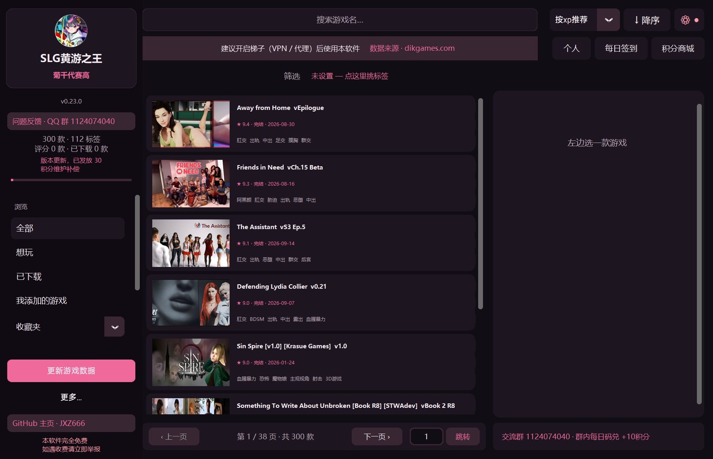
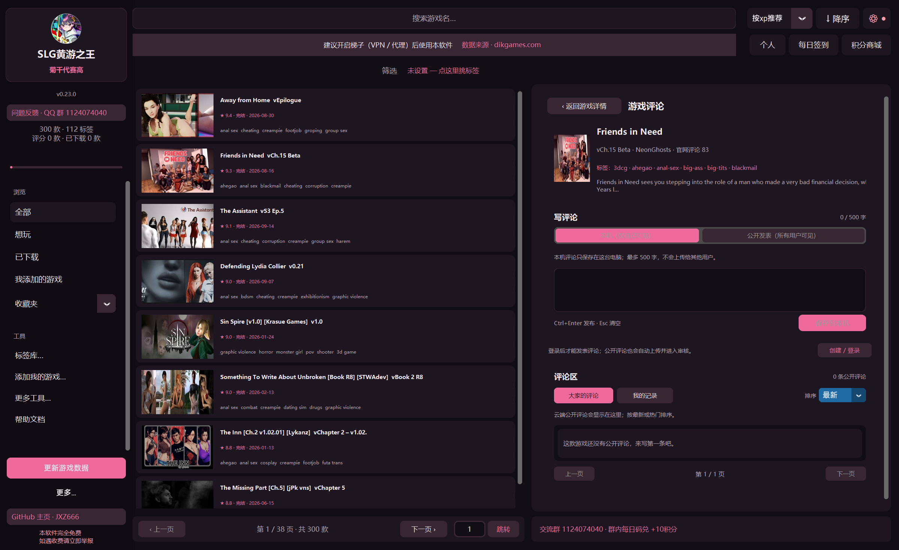

# SLG黄游之王 · SLGking

把游戏检索、按性癖偏好排序、玩家评论和本地游戏管理放在一起的 Windows 桌面工具，面向 18 周岁以上用户。

[访问官网](https://slg-king.com/)　·　[下载稳定版 v0.23.8](https://github.com/JXZ666/slgking/releases/latest)　·　[更新日志](CHANGELOG.md)　·　[GitHub 仓库](https://github.com/JXZ666/slgking)

> 本项目只整理游戏资料并帮助管理本地游戏库，不托管游戏文件，也不提供游戏下载。游戏文件请通过其作者或发行方提供的渠道获取。

图：在桌面客户端浏览游戏目录、筛选标签和查找作品。

## 这款软件能做什么

- 找游戏：搜索游戏名，用标签筛选，再按「站内评分」「热度」「最近更新」等方式排序。选择「按xp推荐」时，列表会参考你给游戏的评分和它们共有的标签、开发者与引擎，优先显示更符合你性癖偏好的作品。
- 看评论、写评论：在游戏详情中打开「写评论&查看评论区」，分页浏览其他玩家公开发布的评论，按最新或热门排序，也可以点赞、点踩和举报。你自己的评论可以保存在本机，也可以选择公开发表。
- 整理游戏：标记「想玩」或「已下载」，建立收藏夹，扫描本地游戏目录、记录安装版本并查看更新提醒。也可以添加目录里没有的游戏，并为本地游戏选择启动程序。

图：在游戏评论区翻页阅读公开评论，或发表自己的评论。

游戏目录资料来自 [dikgames.com](https://dikgames.com)，由项目服务器整理后供客户端同步。官网用于项目介绍、下载和更新信息；游戏检索、评论与游戏库管理在桌面软件中使用。

## 快速开始

1. 从[稳定版发布页](https://github.com/JXZ666/slgking/releases/latest)下载 `slgking.exe` 并运行。当前公开稳定版为 v0.23.8。
2. 首次打开后，点击「更新游戏数据」获取目录和封面。更新完成后，搜索、标签筛选和本机游戏资料浏览可以离线使用。
3. 未登录也可以搜索、筛选游戏目录和查看公开评论。要留下评分、使用收藏夹、签到、积分商城或发表评论，先到「个人」页面创建或登录云端账号。
4. 登录后给熟悉的游戏评分，再在顶栏选择「按xp推荐」；评分越多，排序越能体现你的口味。打开游戏详情中的「写评论&查看评论区」可翻页查看评论或发表自己的评论。

程序数据保存在 exe 以外的位置，替换软件文件不会删除已有资料。登录后可在「更多工具…」中使用「备份与恢复…」迁移个人资料；也可以退出软件后复制整个 `%LOCALAPPDATA%\slgking` 文件夹。账号登录密钥和恢复码不包含在个人资料备份中。

## 云端账号与评论

普通账号不使用邮箱注册。每次「创建账号」都会生成一份新身份；换设备时请用「登录」，不要重复创建，否则新旧账号的积分和评论不会合并。创建账号后，软件会显示一串登录密钥和一串恢复码；请分别妥善保存，它们不会再次显示。新设备登录需要两串密钥；已信任设备在连续 7 天未登录后，也需要恢复码。密钥丢失后无法找回，账号也无法通过邮箱重置。

登录后，昵称、云端积分、头衔、签到记录、名片装饰和公开评论可以在其他设备使用。游戏评分、想玩/已下载状态、收藏夹、本机扫描到的目录和私人评论只留在当前电脑，不会随账号同步。首次创建或登录时，程序会尝试将通过本机存档校验的旧积分与头衔迁入账号一次。

未登录用户可以浏览目录、同步目录并查看公开评论；评分、个人资料、收藏管理、签到、积分商城和发表评论需要登录。每日签到和当天的群兑换码各可获得 10 积分；符合奖励规则的公开评论审核通过后可获得 20 积分，评论奖励有账号和游戏频率限制。公开评论可能展示你的昵称、已装备头衔和名片装饰。私人评论限 500 字，仅保存在本机。其他补偿活动仅在公告显示时开放。

## 数据与隐私

### 数据与联网

- 保存在本机：游戏评分、状态、收藏夹、私人评论、扫描到的游戏目录与启动程序，以及本地偏好和翻译缓存。默认数据目录为 `%LOCALAPPDATA%\slgking`。
- 云端账号数据：账号身份、昵称、云端积分、头衔、签到、名片装饰和你主动公开的评论。忘记登录密钥或恢复码时，项目无法替你重置账号。
- 使用统计：软件会发送随机生成的安装标识、客户端版本、启动平台、游戏条目数，以及少量功能事件和汇总数字（例如本机积分、头衔数和收藏夹数），用于了解版本使用情况。该标识不由硬件信息或云端账号生成。统计不包含本地游戏目录、私人评论正文或游戏文件；公开评论只有在你选择公开发表时才会上传。
- 网络用途：更新游戏目录和封面、检查软件更新、读取公告、使用云端账号与评论，以及发送上述使用统计。目录同步和账号功能需要网络。

## 常见问题

### 软件会下载或启动游戏吗？

不会提供游戏文件或下载地址。软件可以扫描你已有的本地目录；对你手动选择了启动程序的本地游戏，也可以从详情页启动。

### 换电脑后，哪些资料会跟着账号走？

云端账号资产和公开评论可在新设备登录后使用。本机评分、收藏夹、游戏目录、私人评论等需要通过「备份与恢复…」或复制 `%LOCALAPPDATA%\slgking` 迁移。账号密钥与恢复码不包含在本机备份中。

### 为什么我不能发表评论或使用积分功能？

这些个人功能需要先创建或登录云端账号。未登录仍可浏览游戏目录和公开评论。

### 评论通过审核了，为什么没有积分？

奖励只发给符合规则的有效公开评论，并有频率限制：每个账号 7 天内最多 3 条评论获得奖励；同一款游戏 30 天内最多奖励 1 条。待审核或未通过的评论不会立即获得积分。

### 同步失败或评论加载不出来怎么办？

先检查网络，再重试对应操作。目录更新和云端评论依赖服务器，网络或服务器维护时可能暂时不可用；已经保存在本机的资料不会因此被删除。

### 怎样反馈问题或建议？

可在 [GitHub Issues](https://github.com/JXZ666/slgking/issues) 提交问题，也可以加入 QQ 交流群 1124074040。提交截图或日志前，请先确认没有包含个人游戏目录等隐私信息。

## 许可证

本项目采用 [GNU General Public License v3.0](LICENSE)。

### English

SLGking is a Windows desktop catalogue and local library manager for adults aged 18+. It helps you find games by tags, sort them using preferences learned from your local ratings, read and publish community comments, and organize games already on your device. It does not host or distribute game files. Visit the [official website](https://slg-king.com/) or get the latest stable release from [GitHub](https://github.com/JXZ666/slgking/releases/latest).
