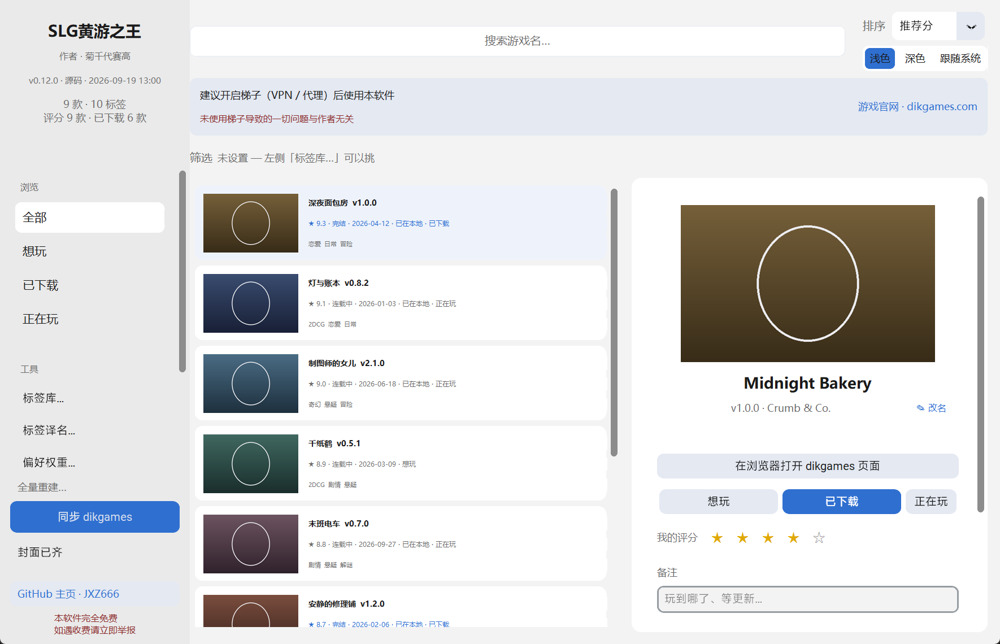
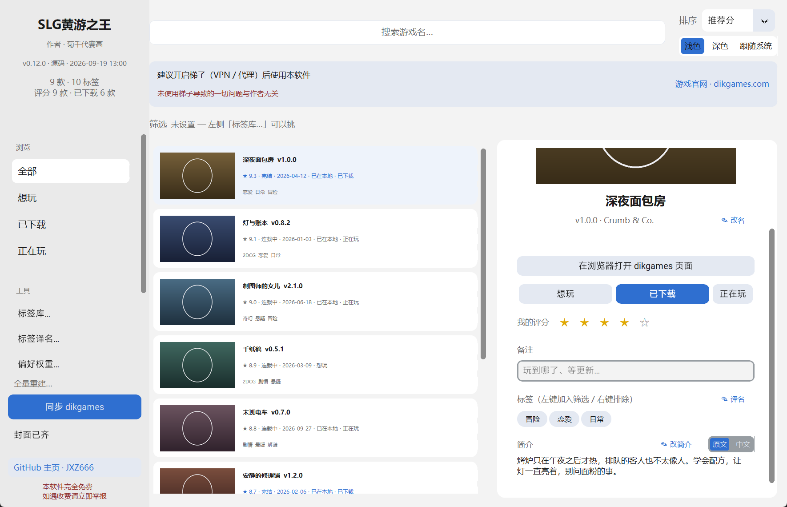
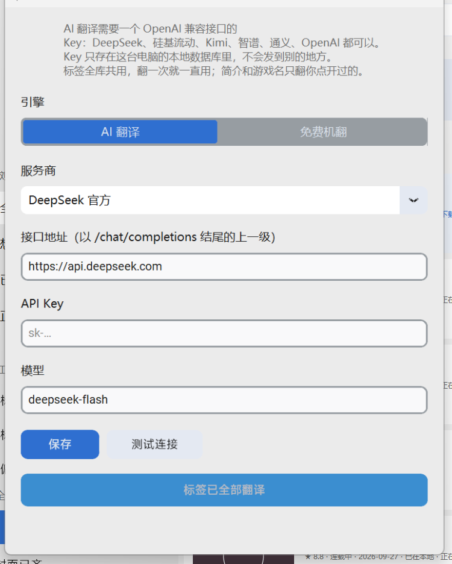

# SLG黄游之王 · slgking

把 dikgames 的清单和本地硬盘上的游戏合成一本账：挑游戏、记进度、追更新。

作者：[JXZ666](https://github.com/JXZ666) · 完全免费，没有收费版



| 详情页 | 翻译设置 |
|---|---|
|  |  |

> 截图里的游戏是编的，封面是画的 —— `python tools/shot_cards.py --demo` 生成的演示库，
> 不是任何真实条目。

## English

`slgking` is a local catalogue for adult Western visual novels. It scrapes
[dikgames.com](https://dikgames.com) into sqlite, merges that with the game
folders already on disk, and gives you one list to pick from — cover art, site
rating, tags as clickable filters, a five-star rating of your own, and a
want / downloaded / playing status that survives restarts.

The point is the memory: every tap is written to the database. Rate a few games
and the tag weights start reordering the list toward what you actually like.

It is a personal tool and stays local. No account, no upload, no telemetry. It
ships with an empty exclusion list on purpose — what you filter is your call,
not mine.

It is a catalogue, not a storefront: it holds no game files and offers no
downloads. Go to the developers' own sites — or find the downloads yourself.

```
slgking                       # the window
slgking scrape --tag netorare # refresh the catalogue and exit
slgking scan                  # reconcile local game folders
slgking updates               # list games with a newer version on the site
```

---

## 它解决什么

dikgames 是个大站（一千多款），但它没有「你」这个概念。它不知道你下过什么、玩到哪、
哪款打到五星、哪款看一眼就关掉了。硬盘上的游戏文件夹也不记账——Ren'Py 不安放清单，
版本号只写在文件夹名里。

于是每次想玩都要重新翻一遍，翻完了还记不住上次为什么跳过某个。

这个工具做四件事：

| | |
|---|---|
| **找游戏** | 封面墙 + 标签求交集筛选，点几下缩小到能看的一屏 |
| **管游戏** | 想玩 / 已下载 / 正在玩 + 五星 + 备注，全部落 sqlite |
| **追更新** | 比文件夹名里的版本号和站上当前版本，列出落后的 |
| **学口味** | 你打的星反推成标签权重，列表按 `站内评分 + Σ标签权重` 排 |
| **改得动** | 游戏名 / 简介 / 标签译名都能就地手改，机翻不会覆盖你改的 |
| **看得舒服** | 浅色 / 深色 / 跟随系统三种主题，右侧顶部切换；左侧「帮助文档」有使用说明和常见问题 |

**所有操作都落库**，关掉重开不会白学。

**本软件完全免费**：没有收费版、没有付费激活、没有隐藏收费入口。如果你是花钱拿到它的，
请立即举报。

**本软件只是一个检索库**：里面没有任何游戏文件，也不提供任何下载。想下载游戏请前往游戏
官网，或者自己去找下载地址。检索到的信息与游戏版权都归原站点和作者所有。

## 快速开始

### 方式一：直接用 exe

1. 到 Releases 下载 `slgking.exe`，丢到桌面（数据不放在 exe 旁边，见下）。
2. 双击 → 左侧「**同步 dikgames**」。首次会抓上千款，需要几分钟。
3. 列表出来了：点标签筛选、右键标签加入排除、卡片上打星、切状态。
4. 「**扫描本地目录**」把游戏库目录（比如 `D:\Games\VisualNovels\`）里的游戏对上号，
   自动标「已下载」。
5. 「**检查更新**」看哪些落后于站点。

### 方式二：从源码运行

需要 Python 3.9+。

```bash
pip install -r requirements.txt
python slg_main.py
```

## 数据放在哪

`%LOCALAPPDATA%\slgking\` —— 数据库 `slgking.db` 和封面缓存 `covers/`。

**不在 exe 旁边**：exe 是给人丢桌面用的，在那儿长出一个 `data` 文件夹很烦人。
也**不走 `%APPDATA%` 或 Windows 的 shell API**：这台机器上 CodePilot 会把用户配置
目录 shadow 到一个临时目录，`[Environment]::GetFolderPath('Desktop')` 和
`WScript.Shell` 的 `SpecialFolders` 都会返回空字符串。`LOCALAPPDATA` 是 Windows
自己设的，不受影响；代码里还有 `HOMEDRIVE` + `HOMEPATH` 作为兜底。

数据是私人的，`.gitignore` 里把 `data/` 整个排除了。

## 翻译

界面是中文的，站点是英文的。左侧「**翻译设置…**」里选引擎：

**AI 翻译** —— 任何 OpenAI 兼容的 `/chat/completions` 接口，预设了
DeepSeek、硅基流动、月之暗面、智谱、通义千问、OpenAI，也可以选「自定义」手填
地址。填自己的 Key，Key 只存在本机数据库里。

**免费机翻** —— Google 网页翻译用的那个公开接口，不需要注册、不需要 Key、不花钱。
走的是 `translate-pa.googleapis.com`，失败自动降级到 lingva 和 gtx，三个都不通
才报错。有时会被限流，等几分钟再试。

两者能做的事不一样，这是有意的：

| | 标签 | 简介 | 游戏名 |
|---|---|---|---|
| AI 翻译 | ✅ | ✅ | ✅ |
| 免费机翻 | ❌ | ✅ | ✅ |

标签是全库一千多张卡片共用的固定术语，机翻同一个词每次给的译法都不一样——同一个
`big-tits` 在两张卡上一个写「巨乳」一个写「大胸」，列表就没法看了。所以标签只用
AI，免费机翻时那个按钮会直接禁用。

翻译结果按「原文的哈希」缓存：简介和游戏名改动过就自动重翻，没改动过永远只翻一次。
游戏名在详情页点「中文」时翻译，翻好后列表卡片也跟着变中文——列表只读缓存，不会
为了显示中文多花一次请求。

### 自己改译名

机翻再好也有读不顺的时候，所以译文都能手改，改完以你为准。

| 改什么 | 在哪改 |
|---|---|
| 游戏名 | 详情页标题右边「✦ 改名」 |
| 简介 | 详情页「简介」那一行的笔按钮，`Ctrl+Enter` 保存 |
| 标签 | 左侧「标签译名…」，一屏列出全库标签 |

**手填的译名不会被机翻覆盖**，哪怕站上原文改了、自动重翻跑了一遍也一样——只有你
自己能改回去。**清空输入框 = 恢复**：游戏名和简介退回英文原文，标签退回自动译名
（没自动译名就是英文）。标签译名里「清除手工译名」只删你手填的那些，机器翻的留着。

改了标签译名，卡片上已经在显示的标签会立刻跟着变，不用重新筛一遍。

## 命令行

```bash
# 抓取（会限速，1 秒一个请求，别把站抓崩）
python slg_main.py scrape --tag netorare --tag corruption --tag cheating

python slg_main.py scrape --tag netorare --dry-run   # 只打印不写库
python slg_main.py scrape --list-tags                # 站上全部标签
python slg_main.py scrape --tag netorare --covers 250 --enrich 250
                                                     # 顺便补 250 张封面 / 250 条详情

# 本地
python slg_main.py scan                    # 扫描默认目录
python slg_main.py scan --root "D:\xxx"    # 换个目录（可重复）
python slg_main.py scan --size             # 顺便统计体积（慢）
python slg_main.py updates                 # 列出有新版

# 翻译（Key 读环境变量 DEEPSEEK_API_KEY 或软件里的设置）
python slg_main.py translate --tags        # 翻所有还没翻过的标签
python slg_main.py translate --overview 123   # 翻某款游戏的简介并打印
python slg_main.py translate --title 123      # 翻某款游戏的名称并打印
python slg_main.py translate --engine google_free --overview 123
                                           # 走免费机翻，不用 Key
python slg_main.py translate --probe       # 只测连通性，不写库

python slg_main.py --version               # 版本号与构建时间
python slg_main.py --smoke                 # 开窗渲染一次就退出（打包自检）
```

`--covers` 和 `--enrich` 是**要花钱的**：站点上评分和完整简介只在详情页，详情页
一个游戏一个请求。所以它们各抓 N 款就停，下次再跑接着补——封面是
`cover_file LIKE 'pending:%'`，详情是 `rating IS NULL`，都是可续的。

## 打包

```bash
python tools\make_icon.py   # 只在改图标时需要，生成 assets\slgking.ico
build_exe.bat
python tools\make_shortcut.py
```

走 `slgking.spec`，单文件。`console=False`：控制台子系统的 exe 会让 Windows 在
任何 Python 代码跑起来之前先开一个黑窗口，而隐藏它并不销毁它，那个 conhost 会挂在
后台直到程序退出。命令行子命令的输出由 `slg_main._attach_console()` 补回来——它借用
启动它的那个终端，双击时没有父终端，`AttachConsole` 直接失败，于是保持无窗口。
customtkinter 的主题和字体由 PyInstaller 的 `hook-customtkinter.py` 收集，`.spec`
里不用手写 `datas`。

图标要写两次，两处管的事不一样：`.spec` 的 `icon=` 是给资源管理器和快捷方式看的
exe 文件图标，`datas` 里那一份是给窗口自己看的（用 `sys._MEIPASS` 读，单文件模式下
`assets` 不在 exe 旁边）。

`make_shortcut.py` 在桌面建「SLG黄游之王」快捷方式。它是 Python 而不是纯
PowerShell 脚本，原因写在文件开头：这台机器上 CodePilot 会 shadow 用户配置目录，
`[Environment]::GetFolderPath('Desktop')` 和 `WScript.Shell` 的 `SpecialFolders`
都返回空；中文快捷方式名走环境变量过去（环境变量以 UTF-16 跨进程），避免
PowerShell 5.1 猜错 `.ps1` 的编码。

## 同步策略

**exe 里不带任何数据。** 打包只把 `assets/slgking.ico` 塞进去，`dist/` 只有一个
exe；清单是每个用户第一次点同步时自己抓的，存在 `%LOCALAPPDATA%\slgking\`。
换电脑带走那个目录，不是带走 exe。

同步早就不是翻页全量了，走的是 sitemap 增量：三个 sitemap 请求列出全站每个 slug
和它的 `<lastmod>`，跟库里的逐条比对，**只有新增的、和 lastmod 变了的才去抓详情页**。
库追上站点之后，一次同步通常就是 3 个请求。

剩下的是两条配额，都是一次性的欠账，跑几次就清了：

| 配额 | 值 | 用途 |
|---|---|---|
| `NEW_PER_RUN` | 200 | 首轮全站新游戏入库，剩下的滚到下次 |
| `ENRICH_PER_SYNC` | 150 | 老游戏补评分 / 简介 / 封面 |

`--incremental` 跑同步，`--enrich N` 单独跑补全。

## 站点结构（抓取依据）

都是拿 curl 实测确认过的，不是猜的：

- 列表页 `/tag/<tag>/page/<N>/`，每页 20 款，页数写在页面里。
- 每个游戏是一个 `<section class="gp-post-item ...">`：
  - `<a href="<url>" title="名字 [版本] [作者]">` —— 名称、版本、作者都在 `title` 属性里
  - `` —— 封面**必须读 `data-src`**，`src` 是
    懒加载的 base64 占位灰块
  - `section` 的 class 里带全部标签和引擎：`tag-netorare`、`platform-renpy`
- 详情页才有：JSON-LD 里的 `ratingValue`（站内评分）、`Version:`、
  `Developer:`、`datePublished`、简介。
- 简介在 Elementor 的 Overview 标签页里，**tab 实例 id 每页都不一样**
  （agent17 是 `-1601`，cane-and-able 是 `-4591`，xxxfiles 是 `-8471`）。
  写死 id 曾让大多数页面的简介抓不到，只能从 tab 标题的
  `aria-controls="elementor-tab-content-<id>"` 反查。正文按 div 深度闭合，
  不能停在第一个 `</div></div>`，否则嵌套一层就把简介截断。

解析前**只剥 `<style>`、不剥 `<script>`**：评分在 JSON-LD 里，就在 script 标签中，
剥掉了就一个都匹配不到；而 CSS 文本会让正则误命中。

`robots.txt` 是 `Disallow:`（空），可以抓。请求带 UA 和 1 秒间隔。

## 项目结构

```
slg_main.py      argparse 入口：无参 → GUI，有参 → CLI
slg_gui.py       customtkinter 主窗口（列表 / 详情 / 筛选 / 打标记）
slg_db.py        sqlite schema、路径、查询、权重计算
slg_scrape.py    dikgames 抓取（列表页解析 / 限速 / 封面 / 详情）
slg_scan.py      本地目录扫描、标题模糊匹配、版本号提取
slg_translate.py 翻译的提示词、回复解析、批量与缓存编排
slg_engines.py   翻译的传输层：AI 引擎、免费机翻、服务商预设、配置解析
assets/          图标（由 tools/make_icon.py 生成）
tools/           make_icon.py（画图标）、make_shortcut.py（桌面快捷方式）、
                 bench_render.py（列表耗时）、shot_cards.py（截图看主题）、
                 smoke_detail.py（详情页手测脚本）
tests/           python -m unittest discover tests
build_exe.bat    ASCII-only 注释
slgking.spec     PyInstaller 单文件
```

## 口味权重怎么算

```
weight(tag) = Σ(我打的星 - 3.0) / (出现次数 + 3)
score(game) = 站内评分 + Σ(该游戏各标签的 weight)
```

打 5 分的游戏，它带的每个标签 +2；打 1 分的 -2；没打过的标签权重是 0。
除以 `(次数 + 3)` 是收缩：只出现过一次就重罚/重赏，不该有那么大话语权。

透明、可解释，设置页能直接看到「堕落 +2.3 / AI图 -4.1」，也能手动改。

## 已知的坑

1. **`data/` 不能放 exe 旁边** —— 桌面会变脏，见上面「数据放在哪」。
2. **控制台是 cp936** —— 所有中文输出先 `sys.stdout.reconfigure(encoding="utf-8")`；
   `.bat` 注释只用 ASCII。（rpykit-luna 已经因为这个问题被逼成全英文注释了。）
3. **`--json` 之类的输出被暂停提示污染，只有打包后才暴露** —— 每改一次都要跑
   打包后的 exe，不能只跑源码。
4. **标题里的 HTML 实体要先 `html.unescape`** —— 站上有 `&#8211;`（短破折号），
   不解码会让本地匹配对不上。
5. **`[Final]` 和版本号会粘在一起** —— 站上写成 `[v1.4.2 Beta][Final] [aura-dev]`，
   所以解析「最后一个括号是作者，前面第一个像版本号的才是版本」。
6. **冻结的 exe 是个快照，不会读旁边的源码** —— 单文件模式下模块都解开在
   `sys._MEIPASS` 里，改完源码不重新打包，双击 exe 跑的还是旧的。
   左侧栏作者行下面那行 `v0.12.0 · exe · 2026-09-19 13:01` 就是给这个用的：
   时间没变，就是没重新打包。`--version` 打印同一行。
7. **别直接写 `ctk.CTkFont()`** —— customtkinter 默认字族是 Roboto，它**一个汉字
   字形都没有**，中文全靠 GDI 字体链接回退，粗体还会走合成加粗糊成一团。统一走
   `ui_font(size, weight)` 这个出口，它挑一个机器上真有的中文字族
   （`Microsoft YaHei UI`）。同理 `✓`/`✕` 在雅黑和宋体里都是空方框，用 `√`/`×`。
8. **卡片脏检查看的是 game id，不是内容** —— `_sync_cards` 只重填「换了个游戏」的
   槽位，所以任何**只改某一列、不动 id** 的任务跑完都必须先调 `_invalidate_cards()`，
   否则新值要等重启才上屏。下封面（改 `cover_file`）和标签翻译（改译名）都属于
   这一类，两边都已经这么做了，加新的同类任务时别漏。详情页另有一条平行的签名
   判断，往 `_render_detail` 读的字段里加东西时记得同步 `_detail_signature()`。

## 不在首版

存档备份、`unlock.rpy` 生成式画廊解锁、路线/结局追踪、汉化流程整合
（列表里只显示汉化状态，不做整合）。

## License

GPL-3.0-or-later，全文见 [LICENSE](LICENSE)。

用它、改它、发给别人都行，包括拿去卖。条件是改了之后再发布，得把源码一起开源，
并且保留原作者署名。**这个软件本身永远免费** —— 没有收费版，没有付费激活。
